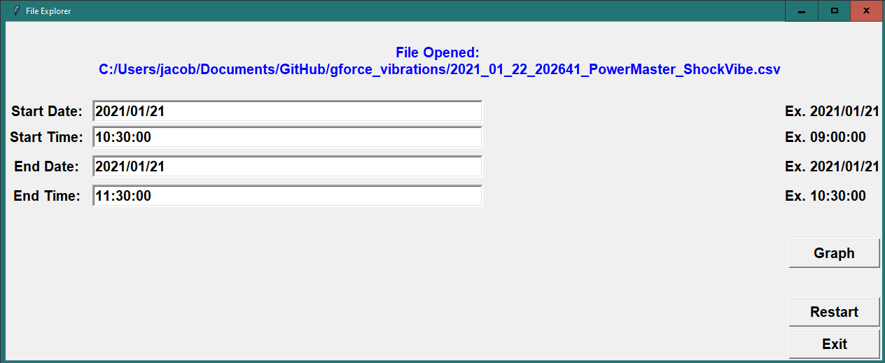
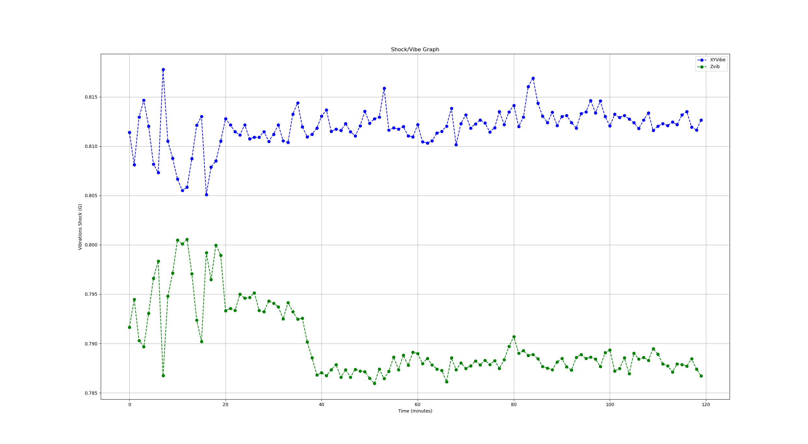

## About the Project
The goal of this project is to generate a time-series plot from formatted data using a GUI. It contains vibrations taken from a electronic logging tool working in the oil and gas industry. 

Steps for the program:
1. User downloads the Excel spreadsheet from the GUI and saves it to their computer.
2. User initiates the script.
3. Script requests a file location, and the user selects the Excel spreadsheet in file explorer.
4. Script requests user input start date, start time, end date, end time.
5. Script generates graph of shock/vibe data versus time.

### Python GUI

## Technologies
* Python
  * Tkinter (Python GUI)
  * Pandas
  * Numpy
  * Pyinstaller (Create .exe file)
  * Matplotlib

